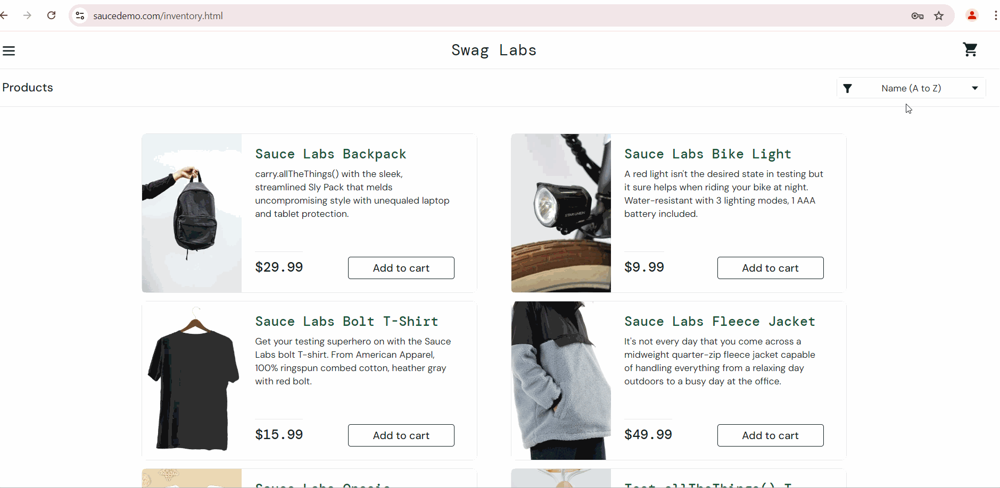
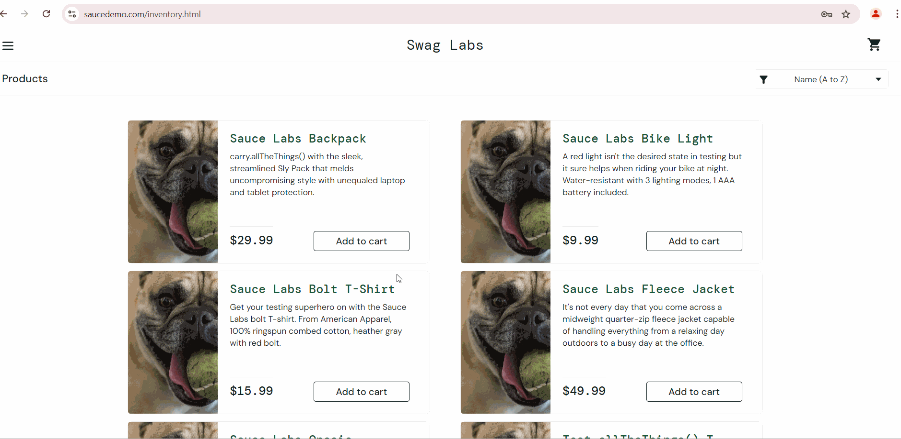
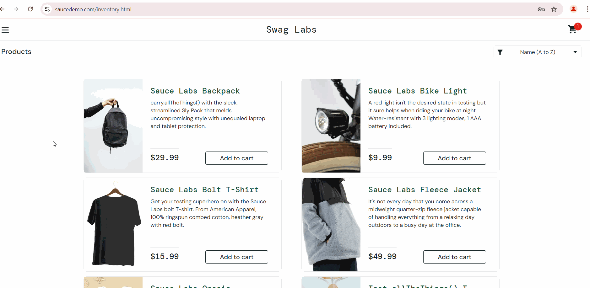

### **[BUG-1] [Inventory] Sorting is not applied**
<pre>
<strong>Steps to reproduce:</strong>
    1. Log in as error_user
    2. Select any sorting option (e.g. Price (high to low) )

<strong>Actual results:</strong>
    - sorting is not applied, 
    - the same sorting option is selected in the sorting dropdown
    
<strong>Expected results:</strong>
    - product items are sorted accordingly,
    - selected sorting option is selected in the sorting dropdown
    
</pre>

##

### **[BUG-2] Impossible to remove product item from the cart on the Inventory page and on the Inventory Item page**
<pre>
<strong>Scenario 1:</strong> Removing item from the shopping cart on the Inventory page

<strong>Steps to reproduce:</strong>
    1. Log in as error_user
    2. Click 'Add to cart' button for any product (e.g. Sauce Labs Backpack)
    3. Click 'Remove' button for the same product

<strong>Actual results:</strong>
    - item is not removed from the cart, 
    - 'Remove' button is displayed
    
<strong>Expected result:</strong>
    - item is removed from the cart,
    - 'Add to cart' button is displayed
    
</pre>
<pre>
<strong>Scenario 2:</strong> Removing item from the shopping cart on the Inventory Item page

<strong>Steps to reproduce:</strong>
    1. Log in as error_user
    2. Click any product title (e.g. Sauce Labs Bolt T-Shirt)
    3. Click 'Add to cart' button
    4. Click 'Remove' button

<strong>Actual results:</strong>
    - item is not removed from the cart, 
    - 'Remove' button is displayed
    
<strong>Expected results:</strong>
    - item is removed from the cart,
    - 'Add to cart' button is displayed
    
</pre>
<pre>
<strong>Note:</strong> Inventory items can be removed on the Shopping Cart page
</pre>

##

### **[BUG-3] [Inventory] Inventory item title click opens Inventory Item page of another item**
<pre>
<strong>Steps to reproduce:</strong>
    1. Log in as error_user
    2. Click any inventory item title (e.g. Sauce Labs Backpack)

<strong>Actual result:</strong> Inventory Item page for another product is opened (e.g. Sause Labs Fleece Jacket)
    
<strong>Expected result:</strong> Inventory item title click opens Inventory Item page for the item described in the title
    
</pre>